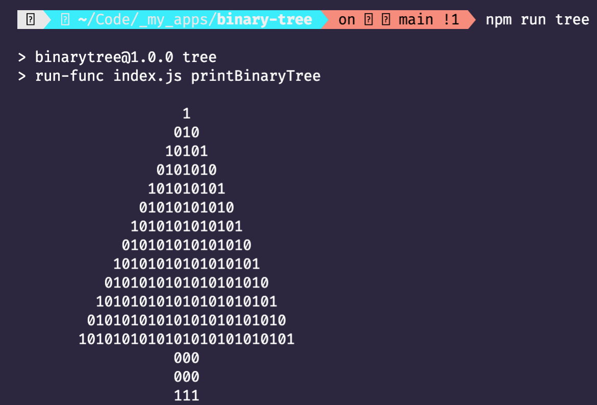

# binary-tree
A binary tree generator in JavaScript. Because coding interviews suck.

### Usage

To run:
```bash
npm i
npm run tree
```

Which prints the following:



A literal binary tree. Et voilà!
